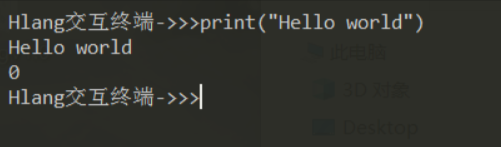
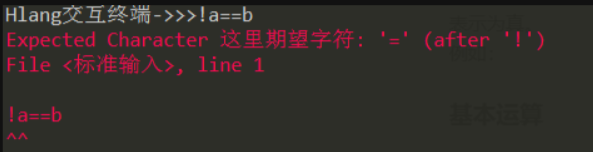
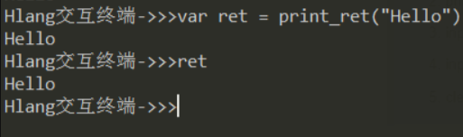
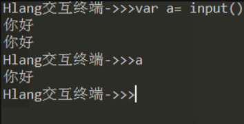
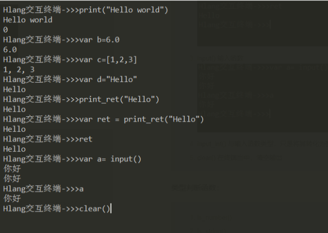
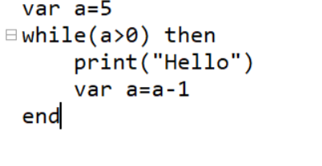

# 介绍
Hlang是一款基于Python编写的支持中英文混合编程的动态语言。其简单易上手，适合作为新手入门的第一个计算机语言。

# Hlang基本使用

## 下载
前往：[https://gitee.com/Huterox/hlang](https://gitee.com/Huterox/hlang) 下载最新发行版本，就可以下载得到最新的Hlang。


下载解压，得到完整的目录。


点击：


就可以打开Hlang。
接下来，我们就可以来一个最经典的"Hello world"。



## 配置环境变量
为了能够跟好的使用Hlang,因此在下载Hlang之后，可以为此配置环境变量。这样一来在终端就能快速打开Hlang。

打开高级系统设置：


点击环境变量配置：


然后点击添加环境变量即可：


之后打开终端输入 Hlang.exe即可进入Hlang终端：


# 特性


Hlang作为一个教学语言，因此，为了大大降低入门门槛，支持在支持英文编程的同时，支持中文编程。
接下来请看到这几个案例。
## 中文关键字


通过关键字 `设` 就可以创建一个变量。同时也支持英文：


## 支持中文符号

此外，支持多个关键字混合编程，同时支持中文标点：
这是一个数学运算案例：


之后的话，切换为中文：


可以发现依然可以正常工作，并且中英文字符同时出现在一个表达式当中

## 混合编程
在实际编程当中，中文关键字和英文关键字可以同时出现：


## 中文错误提示
为了更加方便学习和定位错误，Hlang支持中文报错：



## 终端多行输入

此外，Hlang在终端也支持多行输入语句。通过 ; 进行间隔。（在代码文本当中，也支持;进行语句隔断，也可以直接通过换行）


# 基本数据类型

Hlang支持如下数据结构：

## 整数


## 浮点数


## 列表


## 字符串


# 基本操作

在Hlang当中支持如下关键字：

```
KEYWORDS = [
    'var',
    '设',
    'and',
    '且',
    'or',
    '或',
    'not',
    '否',
    'if',
    '如果',
    'elif',
    '再者',
    'else',
    '不然',
    'for',
    '遍历',
    'to',
    '到',
    'step',
    '步长',
    'while',
    '循环',
    'fun',
    '函数',
    'then',
    '就',
    'end',
    '结束',
    'return',
    '返回',
    'continue',
    '继续',
    'break',
    '终止'
]
```

同时支持如下内置函数：

IO函数：

> 1. print()  输出函数
>
> 
>
> 2. print_ret() 带返回值的输出函数
>
> 
>
> 3. input() 输入函数
>
> 
>
> 
> 4. input_int()  与输入函数类型，只是将其转化为整数类型
>
> 5. clear()  在终端当中，清空输出
>
> 
>
> 


类型判断函数：
只需要将目标变量传入函数即可

> 1. is_num() 
> 2. is_stri()
> 3. is_list()
> 4. is_fun()

示例：


对数据的操作函数：

> 1. append()
> 2. pop()
> 3. extend()
> 4. len()

脚本执行函数：

> 1. run_file()

编写Hlang脚本：

```python
print("Hello world")
```
执行成功：


## 变量定义

通过关键字 var a=3 就可以快速创建一个关键字。
同时也可以通过 设 a=3 来快速创建关键字。

## 逻辑判断
在Hlang没有专门的True，False的Boolean类型。而是返回实数0,1来表示。当返回为0是表示假，为1时表示为真。
例如：


同时这里支持not关键字：


## 基本运算
Hlang支持基本运算：


同时支持次幂运算：


## 条件判断
基本语法如下：


运行结果如下：


注意在这里依然支持中文：


## 循环
Hlang支持for循环和while循环：


注意这里的结果是从1到5但是不包括5.同时你还可以指定步长。

```python
for i=1 to 5 step 1 then
    print("Hello")
end
```



## 函数
之后是Hlang的函数定义：


执行结果：


注意在终端的话，也可以这样定义函数：


同理，我们依然可以使用中文进行编程


